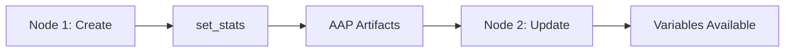

# AAP (Ansible Automation Platform) Workflow Variable Passing Guide

This guide specifically addresses variable passing between playbooks in **Ansible Automation Platform (AAP) Workflows**, which is different from standalone Ansible playbook execution.

## 🚨 **Key Differences in AAP Workflows**

### **1. Variable Scope**
- In standalone Ansible: Variables persist within the same playbook execution
- In AAP Workflows: Each workflow node (playbook) runs in isolation
- **Solution**: Use `set_stats` to pass variables between workflow nodes

### **2. Fact Caching**
- In standalone Ansible: `cacheable: true` works with fact caching
- In AAP Workflows: Facts don't persist between nodes automatically
- **Solution**: Use `set_stats` instead of `cacheable: true`

### **3. Variable Access**
- In standalone Ansible: Variables are directly available
- In AAP Workflows: Variables from previous nodes are available as "artifacts"
- **Solution**: Access artifacts directly by variable name

## 🔧 **Fixed Implementation**

### **Creation Playbook (`test_snow_create_incident.yml`)**

#### ✅ **Correct `set_stats` Usage**
```yaml
- name: Persist variables for AAP workflow (set_stats for inter-playbook communication)
  delegate_to: localhost
  run_once: true
  ansible.builtin.set_stats:
    data:
      incident_sys_id: "{{ created_incident.record.sys_id }}"
      incident_number: "{{ created_incident.record.number }}"
      incident_url: "{{ servicenow_instance }}/nav_to.do?uri=incident.do?sys_id={{ created_incident.record.sys_id }}"
      incident_created_on: "{{ created_incident.record.sys_created_on | default(ansible_date_time.iso8601) }}"
      initial_priority: "{{ created_incident.record.priority }}"
      initial_state_value: "{{ created_incident.record.state }}"
      servicenow_instance: "{{ servicenow_instance }}"
      workflow_timestamp: "{{ ansible_date_time.iso8601 }}"
    aggregate: false  # Important: Don't aggregate with previous stats
  when: 
    - create_incident | default(true) | bool
    - created_incident is succeeded
    - created_incident.record is defined
  tags:
    - set_stats
    - aap_workflow
```

#### ❌ **What Was Wrong Before**
```yaml
# This doesn't work in AAP workflows!
- name: Set incident facts from creation response
  ansible.builtin.set_fact:
    cacheable: true  # ❌ Doesn't persist between AAP nodes
    incident_sys_id: "{{ created_incident.record.sys_id }}"
```

### **Update Playbook (`test_snow_update_incident.yml`)**

#### ✅ **Correct Variable Retrieval**
```yaml
- name: Validate that required variables are available from previous playbook
  ansible.builtin.assert:
    that:
      - incident_sys_id is defined
      - incident_sys_id | length > 0
      - incident_number is defined
      - incident_number | length > 0
    fail_msg: |
      Required variables from previous playbook are missing!
      
      Expected variables:
      - incident_sys_id: {{ incident_sys_id | default('UNDEFINED') }}
      - incident_number: {{ incident_number | default('UNDEFINED') }}
      
      These should be set by the previous playbook using set_stats.
      Check that:
      1. The creation playbook completed successfully
      2. The set_stats task executed without errors
      3. The AAP workflow is properly configured to pass artifacts between nodes
    success_msg: |
      ✅ Required variables found:
      - incident_sys_id: {{ incident_sys_id }}
      - incident_number: {{ incident_number }}
```

#### ❌ **What Was Wrong Before**
```yaml
# The update playbook expected variables to be magically available
- name: Get the information of the incident
  ansible.builtin.debug:
    msg:
      - "Incident Sys ID: {{ incident_sys_id }}"  # ❌ Would be undefined
      - "Incident Number: {{ incident_number }}"  # ❌ Would be undefined
```

## 🎯 **AAP Workflow Configuration Requirements**

### **1. Workflow Template Setup**
1. Create **Workflow Template** in AAP
2. Add **Job Template** nodes for each playbook
3. Configure **Success** links between nodes
4. Ensure **"Prompt on Launch"** is enabled for variables that need to be passed

### **2. Node Configuration**
```yaml
# Node 1: Creation Playbook
Job Template: "ServiceNow Create Incident"
Inventory: "localhost"
Credentials: "ServiceNow Credentials"

# Node 2: Update Playbook  
Job Template: "ServiceNow Update Incident"
Inventory: "localhost"
Credentials: "ServiceNow Credentials"
# ✅ Variables from Node 1 will be automatically available via set_stats
```

### **3. Variable Passing Flow**


## 🧪 **Testing Your AAP Workflow**

### **1. Debug Variable Availability**
Add this task to any playbook to see what variables are available:

```yaml
- name: Debug all available variables
  ansible.builtin.debug:
    msg:
      - "All variables:"
      - "{{ hostvars[inventory_hostname] }}"
      - ""
      - "AAP Workflow Variables:"
      - "incident_sys_id: {{ incident_sys_id | default('NOT_FOUND') }}"
      - "incident_number: {{ incident_number | default('NOT_FOUND') }}"
      - "workflow_timestamp: {{ workflow_timestamp | default('NOT_FOUND') }}"
  tags:
    - debug
    - aap_variables
```

### **2. Test Creation Playbook Standalone**
```bash
# Test the creation playbook first
ansible-playbook playbooks_test/test_snow_create_incident.yml \
  -e servicenow_instance="dev12345.service-now.com" \
  -e servicenow_username="admin" \
  -e servicenow_password="password" \
  -e incident_short_description="Test incident for AAP workflow"
```

### **3. Test Update Playbook with Manual Variables**
```bash
# Test the update playbook with manually provided variables
ansible-playbook playbooks_test/test_snow_update_incident.yml \
  -e servicenow_instance="dev12345.service-now.com" \
  -e servicenow_username="admin" \
  -e servicenow_password="password" \
  -e incident_sys_id="your-test-sys-id" \
  -e incident_number="INC0000123" \
  -e incident_assignment_group="IT Support" \
  -e incident_state="in_progress"
```

## 🐛 **Common AAP Workflow Issues and Solutions**

### **Issue 1: Variables Not Found**
```
FAILED - Required variables from previous playbook are missing!
```

**Causes:**
- Previous playbook failed
- `set_stats` task didn't execute
- `when` conditions prevented `set_stats` execution
- AAP workflow not properly linked

**Solutions:**
1. Check AAP job history for the creation playbook
2. Verify `set_stats` task shows in the output
3. Check workflow template node connections
4. Add debug tasks to see what variables are available

### **Issue 2: `set_stats` Not Working**
```
Variables are undefined in the next playbook
```

**Causes:**
- Missing `delegate_to: localhost`
- Missing `run_once: true`
- `aggregate: true` overwriting variables
- Task not executing due to `when` conditions

**Solutions:**
```yaml
# Correct set_stats format
- name: Persist variables for AAP workflow
  delegate_to: localhost  # ✅ Required
  run_once: true         # ✅ Required  
  ansible.builtin.set_stats:
    data:
      your_variable: "{{ your_value }}"
    aggregate: false     # ✅ Don't aggregate
  when: your_condition   # ✅ Make sure this evaluates to true
```

### **Issue 3: Authentication/Connection Issues**
```
servicenow.itsm.incident module fails with authentication error
```

**Solutions:**
1. Verify credentials are configured in AAP
2. Check credential type is correct
3. Ensure module_defaults are properly set
4. Test connection manually first

## 🔒 **Security Best Practices for AAP**

### **1. Credential Management**
```yaml
# ❌ Don't hardcode credentials
servicenow_username: "admin"
servicenow_password: "password123"

# ✅ Use AAP Credentials
# Configure ServiceNow credentials in AAP and reference them in job templates
```

### **2. Variable Encryption**
```yaml
# For sensitive data in set_stats
- name: Persist variables (with sensitive data handling)
  ansible.builtin.set_stats:
    data:
      incident_sys_id: "{{ created_incident.record.sys_id }}"
      # Don't include sensitive data in set_stats unless necessary
    aggregate: false
  no_log: true  # Hide from logs if needed
```

### **3. Input Validation**
```yaml
- name: Validate input parameters
  ansible.builtin.assert:
    that:
      - servicenow_instance is match("^[a-zA-Z0-9.-]+$")
      - incident_short_description | length > 5
      - incident_urgency in ['low', 'medium', 'high']
    fail_msg: "Invalid input parameters provided"
```

## 📊 **Monitoring and Logging**

### **1. Enhanced Logging**
```yaml
- name: Log workflow progress
  ansible.builtin.debug:
    msg:
      - "🚀 AAP Workflow Step: {{ ansible_play_name }}"
      - "Timestamp: {{ ansible_date_time.iso8601 }}"
      - "Node: {{ tower_job_template_name | default('Unknown') }}"
      - "Workflow: {{ tower_workflow_job_id | default('Unknown') }}"
  tags:
    - always
    - logging
```

### **2. Error Handling**
```yaml
- name: Handle ServiceNow API failures
  block:
    - name: Create/update incident
      servicenow.itsm.incident:
        # ... incident parameters
      register: incident_result
  rescue:
    - name: Log error and set failure stats
      ansible.builtin.set_stats:
        data:
          workflow_failed: true
          failure_reason: "{{ incident_result.msg | default('Unknown error') }}"
          failure_timestamp: "{{ ansible_date_time.iso8601 }}"
        aggregate: false
    
    - name: Fail the playbook
      ansible.builtin.fail:
        msg: "ServiceNow operation failed: {{ incident_result.msg | default('Unknown error') }}"
```

## 🚀 **Example AAP Workflow Template**

### **Workflow JSON Export Example**
```json
{
  "name": "ServiceNow Incident Management Workflow",
  "description": "Create and update ServiceNow incidents via AAP workflow",
  "workflow_nodes": [
    {
      "id": 1,
      "job_template": "ServiceNow Create Incident",
      "inventory": "localhost",
      "credentials": ["ServiceNow Credentials"],
      "success_nodes": [2]
    },
    {
      "id": 2,
      "job_template": "ServiceNow Update Incident", 
      "inventory": "localhost",
      "credentials": ["ServiceNow Credentials"],
      "extra_vars": {
        "incident_assignment_group": "IT Support",
        "incident_state": "in_progress"
      }
    }
  ]
}
```

## 📝 **Summary of Fixes Applied**

1. **✅ Fixed `set_stats` implementation** with proper conditions and `aggregate: false`
2. **✅ Added variable validation** in the update playbook with helpful error messages
3. **✅ Implemented proper error handling** with detailed assertions
4. **✅ Added AAP workflow context** to work notes and logging
5. **✅ Included next-step `set_stats`** for potential workflow expansion
6. **✅ Enhanced debugging** with comprehensive variable display

Your AAP workflow should now properly pass variables between the creation and update playbooks!

